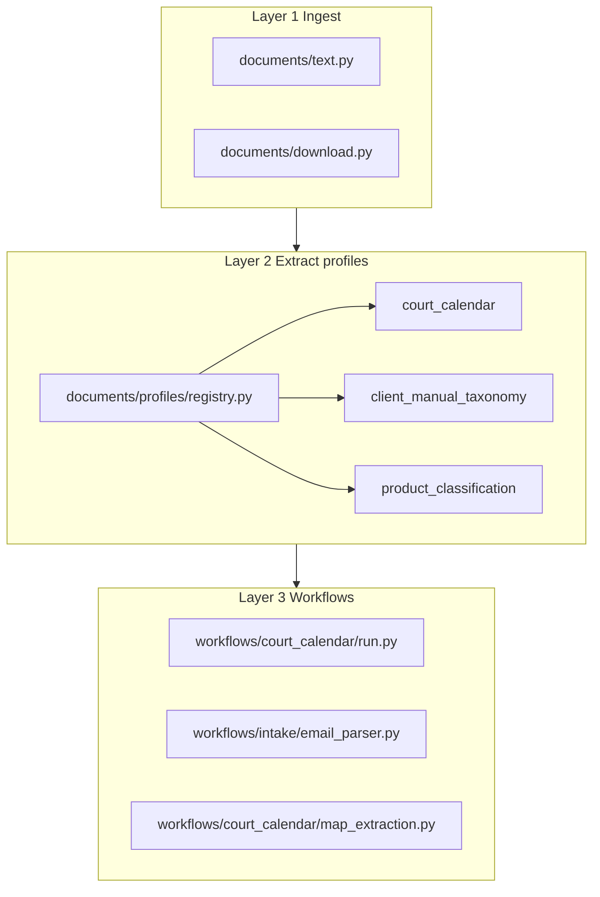
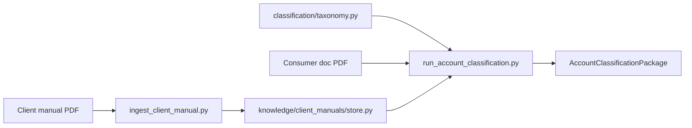

# Architecture

Pollack is an agentic document platform built around three layers: **ingest**, **extract profiles**, and **workflows**. The primary workflow turns court scheduling PDFs into a human-reviewable `ReviewPackage` with calendar-ready events and flagged items.

## Platform layers



| Layer | Key files | Role |
|-------|-----------|------|
| Ingest | [`documents/text.py`](../documents/text.py), [`documents/download.py`](../documents/download.py) | Load PDF text (OCR or native), download PDFs from URLs into `data/downloads/` |
| Extract profiles | [`documents/profiles/registry.py`](../documents/profiles/registry.py) | Route a PDF to the right extraction logic by profile name |
| Workflows | [`workflows/court_calendar/`](../workflows/court_calendar/), [`workflows/intake/email_parser.py`](../workflows/intake/email_parser.py) | Orchestrate ingest → extract → map → output |

### Extract profiles

Registered in [`documents/profiles/registry.py`](../documents/profiles/registry.py):

| Profile | Output | Used by |
|---------|--------|---------|
| `court_calendar` | `CaseExtraction` | Court scheduling workflow |
| `client_manual_taxonomy` | `ClientTaxonomy` | Manual ingest |
| `product_classification` | `ProductClassification` | Consumer doc classification (nine account types) |

Call programmatically:

```python
from pathlib import Path
from documents.profiles.registry import extract_document

result = await extract_document(Path("fixtures/case 1.pdf"), profile="court_calendar")
```

## Court pipeline data flow


### Step-by-step

1. **OCR** — [`court/pdf_text.py`](../court/pdf_text.py) renders each PDF page to PNG via PyMuPDF, sends it to olmocr2 (`OLLAMA_MODEL_OCR`), and concatenates page text. Cached at `{pdf_stem}.ocr.txt` beside the PDF.

2. **Extract** — [`court/extract.py`](../court/extract.py) runs three pydantic-ai agents (qwen, `OLLAMA_MODEL`) on the OCR text:
   - Case metadata (caption, number, court)
   - Events (hearings, trial periods)
   - Deadlines (absolute and relative)

3. **Normalize** — [`court/normalize.py`](../court/normalize.py) cleans LLM output (e.g. strip hallucinated Zoom URLs, unify date formats).

4. **Map** — [`workflows/court_calendar/map_extraction.py`](../workflows/court_calendar/map_extraction.py) converts `CaseExtraction` → `ReviewPackage`:
   - Events with explicit dates → `schedulable_events`
   - Relative deadlines, missing dates, `needs_review` items → `flagged_items`

5. **Output** — JSON `ReviewPackage` via [`scripts/run_court_workflow.py`](../scripts/run_court_workflow.py) or [`agents/supervisor.py`](../agents/supervisor.py).

### Email intake path

[`workflows/intake/email_parser.py`](../workflows/intake/email_parser.py) parses `.eml` files → `IntakeEmail`. PDF links are downloaded via `PdfStore` → then the same court pipeline runs on each attachment.

## Key schemas

### `CaseExtraction` ([`court/schemas.py`](../court/schemas.py))

Structured parse of a court document:

| Field | Description |
|-------|-------------|
| `case_number`, `case_caption`, `court` | Case identity |
| `events[]` | Hearings, docket soundings, trial periods — each with `date`, `time`, `location_type`, `virtual_meeting_id`, `source_quote` |
| `deadlines[]` | Filing/compliance items — `kind` is `absolute` (has `due_date`) or `relative` (`offset_days`, `anchor_event`, `direction`) |
| `extraction_notes[]` | Warnings from normalization |
| `page_count` | PDF page count |

Every event and deadline carries a **`source_quote`** — verbatim text from the document for audit.

### `ReviewPackage` ([`workflows/schemas.py`](../workflows/schemas.py))

Scheduling output for human review:

| Field | Description |
|-------|-------------|
| `schedulable_events[]` | Calendar-ready items with `start`, `end`, `timezone`, `location`, `virtual_meeting_id` |
| `flagged_items[]` | Items needing human action — relative deadlines, missing dates, uncertain extractions |
| `extraction` | Full `CaseExtraction` embedded for traceability |
| `source_pdf_path` | Which PDF produced this package |

### Calendar vs flagged — mapper rules

Implemented in [`map_extraction.py`](../workflows/court_calendar/map_extraction.py):

| Source | Becomes | Why |
|--------|---------|-----|
| Event with `date` + `time` | `SchedulableEvent` | Concrete datetime |
| Event with `needs_review=True` | `FlaggedItem` | Extraction uncertain |
| Event missing `date` | `FlaggedItem` | Cannot schedule |
| Absolute deadline with `due_date` | `SchedulableEvent` (kind=`deadline`) | Computable |
| Relative deadline | `FlaggedItem` | Needs anchor date resolved by human |
| Absolute deadline missing `due_date` | `FlaggedItem` | Cannot compute |

Relative deadlines are **never auto-computed** in v1 — they appear in `flagged_items` with a reason like `"Relative deadline: 30 days before Docket Sounding"`.

## LLM layer

| Component | File | Model |
|-----------|------|-------|
| Agent factory | [`tutorials/config.py`](../tutorials/config.py) | Creates pydantic-ai `Agent` instances wired to Ollama |
| OCR | [`court/pdf_text.py`](../court/pdf_text.py) | `OLLAMA_MODEL_OCR` (olmocr2) |
| Extract (3 passes) | [`court/extract.py`](../court/extract.py) | `OLLAMA_MODEL` (qwen), temperature 0, 3 retries |

The `tutorials/` directory name is historical — it contains the shared LLM factory used by production code.

## Agents platform

Not a LangGraph loop. The "supervisor" is a **deterministic async router**:

| Component | File | Role |
|-----------|------|------|
| Supervisor | [`agents/supervisor.py`](../agents/supervisor.py) | Routes PDF vs email to workflow |
| Audit log | [`agents/audit.py`](../agents/audit.py) | SQLite run history at `data/workflow_runs.db` |
| Tool registry | [`agents/registry.py`](../agents/registry.py) | Documents which tools belong to each workflow (contract, not runtime dispatch) |
| Deps | [`agents/deps.py`](../agents/deps.py) | Shared `WorkflowDeps` (PdfStore, AuditLog, knowledge root) |

## Classification workflow

Secondary workflow for consumer account classification (nine account types + `unknown`):



1. Optional: ingest manual → extract taxonomy + chunk index ([`knowledge/client_manuals/store.py`](../knowledge/client_manuals/store.py))
2. Classify consumer PDF → OCR → merge baseline + client taxonomy → retrieve manual passages → LLM classification via `product_classification` profile → `AccountClassificationPackage`

Account types: `credit_card`, `personal_loan`, `auto_loan`, `student_loan`, `mortgage`, `heloc`, `medical_bill`, `bnpl`, `telecom`, `unknown`.

### `AccountClassificationPackage` ([`workflows/schemas.py`](../workflows/schemas.py))

| Field | Description |
|-------|-------------|
| `client_id`, `consumer_id` | Client and optional consumer traceability |
| `account_type` | Classified account type |
| `confidence`, `needs_review`, `review_reasons` | Human-review signals |
| `evidence_quotes`, `manual_citations`, `alternative_types` | Audit trail |
| `classification` | Full `ProductClassification` embedded |
| `source_pdf_path`, `ocr_cache_path` | Document provenance |

## Runtime data paths

| Path | Created by | Purpose |
|------|------------|---------|
| `{pdf_dir}/{stem}.ocr.txt` | OCR pipeline | Page text cache |
| `data/downloads/` | `PdfStore` | Downloaded PDFs from email URLs |
| `data/workflow_runs.db` | Audit log | Workflow run history |
| `evals/runs/{suite}/{timestamp}/` | Eval snapshots | Regression artifacts |
| `knowledge/client_manuals/{client_id}/` | Manual ingest | Taxonomy JSON + text chunks |

These paths are created on first use and are local to the machine (not committed).
