# Pollack — complete guide (Windows)

This is the single documentation file for Pollack. It combines the old architecture, development, CLI, eval, and fixture docs into one place. It is written for someone who can run commands, edit a file, and read JSON, but does not need to be a senior engineer.

You do **not** need to understand machine learning. Pollack is a set of Python scripts that:

1. Read a file you already have (a court PDF, a consumer statement, a portfolio `.dat` file, or a folder of PDFs).
2. Turn that file into text (OCR — optical character recognition — meaning “look at each page like a human would and type out the words”).
3. Ask a local language model (a small AI that runs on your computer via [Ollama](https://ollama.com/)) to pull out structured facts.
4. Print or save a JSON file — a structured text format that looks like `{ "key": "value" }` — that a person or another program can review.

Every command below is **Windows PowerShell**. Run them from the project root folder (the folder that contains `README.md`, `requirements.txt`, and the `scripts` folder).

---

## Table of contents

1. [What Pollack does, in plain English](#1-what-pollack-does-in-plain-english)
2. [The four jobs (workflows)](#2-the-four-jobs-workflows)
3. [What you need on Windows](#3-what-you-need-on-windows)
4. [First-time setup](#4-first-time-setup)
5. [Project layout](#5-project-layout)
6. [How the pieces fit together](#6-how-the-pieces-fit-together)
7. [Workflow A — Court calendar](#7-workflow-a--court-calendar)
8. [Workflow B — Account classification](#8-workflow-b--account-classification)
9. [Workflow C — Portfolio classification](#9-workflow-c--portfolio-classification)
10. [Workflow D — PII redaction](#10-workflow-d--pii-redaction)
11. [CLI reference (every script)](#11-cli-reference-every-script)
12. [Calling Pollack from Python](#12-calling-pollack-from-python)
13. [Evals (quality checks)](#13-evals-quality-checks)
14. [Sample fixtures](#14-sample-fixtures)
15. [Tests, debugging, and a new machine](#15-tests-debugging-and-a-new-machine)
16. [How the AI layer works](#16-how-the-ai-layer-works)
17. [Glossary](#17-glossary)

---

## 1. What Pollack does, in plain English

Law firms receive a lot of PDFs: court scheduling orders, consumer account statements, and large portfolio dumps. People currently read those PDFs by hand and type dates, account types, and redactions into other systems.

Pollack is a **local document pipeline**. “Pipeline” just means a fixed sequence of steps. You start a script, it does step 1, then step 2, then step 3, and it writes a result. It is not a chat bot you talk to. It is not a website.

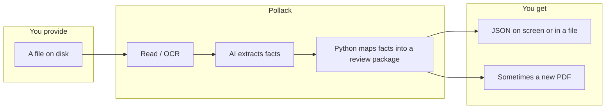

Important properties:

- **Local first.** By default the AI models run on your machine through Ollama. Nothing is uploaded unless you flip `USE_OPENAI=true` in `.env`.
- **Human review is expected.** Pollack never silently “decides” a relative deadline like “30 days before Docket Sounding.” Those items go into a `flagged_items` list with a reason a person can read.
- **OCR is cached.** The first time you OCR a PDF it can take many minutes. Pollack writes a sidecar file next to the PDF named `{same-name}.ocr.txt`. The next run reuses that file.

---

## 2. The four jobs (workflows)

A **workflow** is one complete job with a known input and a known output. Pollack has four:

| Workflow | You give it | You get back | Typical command |
|----------|-------------|--------------|-----------------|
| Court calendar | A court PDF, or an `.eml` email that links to PDFs | `ReviewPackage` JSON (calendar-ready events + items a human must handle) | `python scripts\run_court_workflow.py --pdf "..."` |
| Account classification | A consumer statement PDF + a client id | `AccountClassificationPackage` JSON (which of 7 account types it is) | `python scripts\run_account_classification.py acme "..."` |
| Portfolio classification | A fixed-width `.dat` file + optional folder of account PDFs | `PortfolioClassificationBatch` JSON (one result per account) | `python scripts\run_portfolio_classification.py --dat "..."` |
| Redaction | One or more PDFs (or a folder) | New `*.redacted.pdf` files + a `RedactionBatch` JSON manifest | `python scripts\run_redaction.py "..."` |

There is also a lower-level court extract script (`extract_court_doc.py`) that stops after structured extraction and does **not** build the calendar package. Use that when you want to inspect what the AI pulled out before mapping.

---

## 3. What you need on Windows

| Thing | Why | How to tell you have it |
|-------|-----|-------------------------|
| **Windows 10 or 11** | This guide assumes PowerShell | Open the Start menu and type `PowerShell` |
| **Python 3.12 or newer** | The project language | `python --version` should print `Python 3.12.x` or higher. If `python` is missing, try `py -3.12 --version` |
| **Ollama** | Runs the two local AI models | After install, `ollama list` prints a table |
| **Two models** | One reads page images (OCR). One turns text into JSON | `ollama list` should include `qwen2.5:7b` and `richardyoung/olmocr2:7b-q8` |
| **This repo** | The code | You are in a folder that contains `requirements.txt` |

Optional, for faster testing only:

- An OpenAI API key. Set `USE_OPENAI=true` and `OPENAI_API_KEY=...` in `.env`. Flip `USE_OPENAI` back to `false` when you want local models again.

You do **not** need Node, Docker, a database server, or a GPU. A CPU-only machine works. OCR and extraction will just be slower (often many minutes per PDF).

---

## 4. First-time setup

Open **PowerShell**. `cd` into the project folder. Example:

```powershell
cd C:\Users\YourName\pollack
```

### 4.1 Create a virtual environment

A virtual environment (`.venv`) is a private copy of Python libraries for this project only. It keeps Pollack’s packages from colliding with other Python work on the same PC.

```powershell
python -m venv .venv
.\.venv\Scripts\Activate.ps1
python -m pip install --upgrade pip
pip install -r requirements.txt
```

If `Activate.ps1` errors with “running scripts is disabled,” allow scripts for your user only (this is a normal Windows first-time step):

```powershell
Set-ExecutionPolicy -Scope CurrentUser RemoteSigned
.\.venv\Scripts\Activate.ps1
```

When the venv is active, your prompt usually starts with `(.venv)`. Stay in that state for every command in this guide.

If `python` is not 3.12+, use the Windows launcher instead:

```powershell
py -3.12 -m venv .venv
.\.venv\Scripts\Activate.ps1
py -3.12 -m pip install -r requirements.txt
```

The project has **no** `pyproject.toml`. Dependencies live only in `requirements.txt`.

### 4.2 Install Ollama and pull the two models

In PowerShell (this downloads the official Windows installer script):

```powershell
irm https://ollama.com/install.ps1 | iex
```

After install, Ollama usually sits in the system tray and is already running. Then pull the models (large downloads; do this once):

```powershell
ollama pull qwen2.5:7b
ollama pull richardyoung/olmocr2:7b-q8
```

- `qwen2.5:7b` — used for structured extraction and classification (turning text into JSON).
- `richardyoung/olmocr2:7b-q8` — used for page OCR (reading a rendered PDF page).

### 4.3 Create your `.env` file

`.env` is a plain-text settings file in the project root. Copy the example:

```powershell
Copy-Item .env.example .env
```

Default contents (you can leave these as-is for local Ollama):

```
OLLAMA_BASE_URL=http://localhost:11434/v1
OLLAMA_MODEL=qwen2.5:7b
OLLAMA_MODEL_OCR=richardyoung/olmocr2:7b-q8
OLLAMA_TIMEOUT_S=1200
USE_OPENAI=false
OPENAI_API_KEY=
OPENAI_MODEL=gpt-4o-mini
OPENAI_MODEL_OCR=gpt-4o-mini
```

| Variable | Meaning |
|----------|---------|
| `OLLAMA_BASE_URL` | Where Ollama’s OpenAI-compatible API listens. Leave this unless you changed Ollama’s port. |
| `OLLAMA_MODEL` | The extraction / classification model. |
| `OLLAMA_MODEL_OCR` | The vision OCR model. |
| `OLLAMA_TIMEOUT_S` | Max seconds to wait on one local model call. Raise this on a slow CPU (default is 20 minutes). |
| `USE_OPENAI` | `true` sends every agent to OpenAI instead of Ollama. Temporary testing switch. |
| `OPENAI_API_KEY` | Required only when `USE_OPENAI=true`. |
| `OPENAI_MODEL` / `OPENAI_MODEL_OCR` | OpenAI model names when that switch is on. |

Scripts, evals, and `agents\config.py` load this file with `python-dotenv`. You do not export the variables yourself.

### 4.4 Smoke test

```powershell
python scripts\check_ollama.py
```

**Sample output when things are working:**

```
Installed models: ['qwen2.5:7b', 'richardyoung/olmocr2:7b-q8']
Smoke test: ok
```

If the extract model is missing, the script prints a `ollama pull ...` hint and exits with an error.

### 4.5 First real run (optional)

If you have the local court fixtures (see [Sample fixtures](#14-sample-fixtures)):

```powershell
python scripts\extract_court_doc.py "fixtures\court\case 1.pdf" --pretty
python scripts\run_court_workflow.py --pdf "fixtures\court\case 1.pdf" --pretty
```

The first OCR of a multi-page PDF is slow. After it finishes you will see a new file `fixtures\court\case 1.ocr.txt` sitting next to the PDF. Later runs reuse that cache unless you pass `--refresh-ocr`.

---

## 5. Project layout

You do not need to memorize this. Use it as a map when someone says “look in `court/`.”

| Folder | What lives there |
|--------|------------------|
| `court\` | Court-document schemas, the three-pass extract agents, and cleanup (“normalization”) of messy AI output |
| `workflows\` | The four jobs: court calendar, account classification, portfolio classification, redaction, plus email intake |
| `documents\` | Shared OCR, PDF download, and the “extract profile” registry (which extraction recipe to use) |
| `redaction\` | Detect names/SSNs/addresses, find them on the page, paint black boxes, write `*.redacted.pdf` |
| `agents\` | How models are created, the supervisor (a router, not a chat loop), audit log, tool-name registry |
| `knowledge\` | Stored client manuals and officer-code → account-type tables |
| `classification\` | Account-type schemas and the baseline taxonomy (the seven firm archetypes) |
| `portfolio\` | `.dat` parser, PDF locator, and the tool-using agent for ambiguous officer codes |
| `evals\` | Quality-check harness, golden files, regression snapshots |
| `scripts\` | The commands you actually type |
| `tests\` | Pytest suite (most of it does **not** call Ollama) |
| `fixtures\` | Sample PDFs and synthetic portfolio files (mostly gitignored; you copy them onto the machine) |
| `data\` | Created at runtime: downloaded PDFs, SQLite audit log. Not committed. |
| `docs\` | This guide |

---

## 6. How the pieces fit together

Pollack is three layers stacked on top of each other. A layer only talks to the one above or below it.

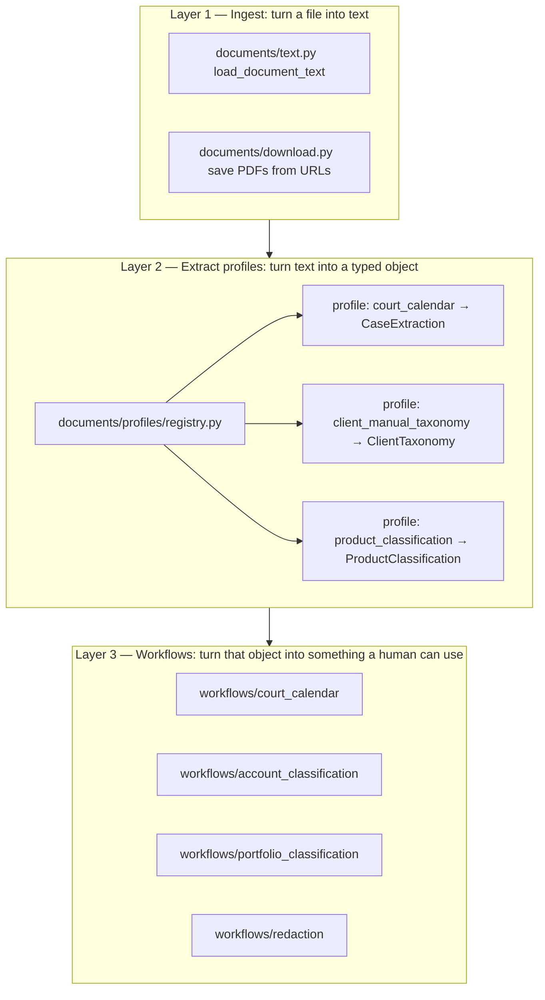

| Layer | Everyday meaning | Key files |
|-------|------------------|-----------|
| 1. Ingest | “Open the PDF and get the words.” Downloads email-linked PDFs into `data\downloads\`. | `documents\text.py`, `documents\ocr.py`, `documents\download.py` |
| 2. Extract profiles | “Given those words, fill in a form.” The form is a Pydantic model (a typed Python class that becomes JSON). | `documents\profiles\registry.py` |
| 3. Workflows | “Take the filled form and decide what a calendar / classifier / redactor should emit.” | `workflows\*\run.py` |

Registered extract profiles:

| Profile name | Output type | Used by |
|--------------|-------------|---------|
| `court_calendar` | `CaseExtraction` | Court scheduling |
| `client_manual_taxonomy` | `ClientTaxonomy` | Ingesting a client’s product manual |
| `product_classification` | `ProductClassification` | Consumer account classification |

The “supervisor” in `agents\supervisor.py` is **not** an AI that chooses a path. It is a small async function that says: if you passed a PDF, run the PDF workflow; if you passed an email, run the email workflow. Routing is deterministic.

---

## 7. Workflow A — Court calendar

**Job:** Read a court scheduling PDF (or an intake email that points at one) and produce a review package: events a calendar can accept, plus a list of things a human must resolve.

### 7.1 Input format

Two legal inputs:

1. **A PDF on disk** — scanned or digital court order. Path example: `fixtures\court\case 1.pdf`
2. **An `.eml` file** — a saved email. Pollack looks for a `Documents:` section and any `https://...pdf` links, downloads those PDFs, then runs the same pipeline.

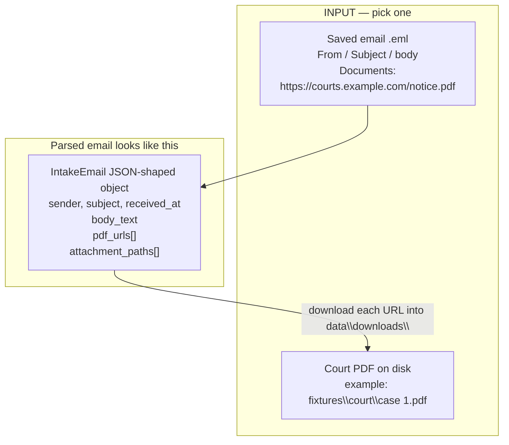

**Sample email body** the parser understands:

```
Court Notice

Documents:
https://courts.example.com/files/notice.pdf

CONFIDENTIALITY NOTICE
This email is privileged.
```

The confidentiality footer is stripped. The PDF URL is kept. The parsed object looks like:

```json
{
  "sender": "clerk@courts.gov",
  "subject": "Scheduling Order",
  "received_at": "2026-04-02T09:14:00",
  "body_text": "Court Notice\n\nDocuments:\nhttps://courts.example.com/files/notice.pdf",
  "pdf_urls": ["https://courts.example.com/files/notice.pdf"],
  "attachment_paths": [],
  "documents_section": "https://courts.example.com/files/notice.pdf"
}
```

### 7.2 What happens inside

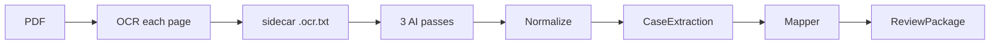

Step by step:

1. **OCR** (`documents\ocr.py`). Each page is rendered to a PNG with PyMuPDF, sent to olmocr2, and the page texts are concatenated. The cache file looks like this (this is the **OCR output format**):

```
--- Page 1 ---
IN THE COUNTY COURT OF THE TWENTIETH JUDICIAL CIRCUIT
IN AND FOR LEE COUNTY, FLORIDA
CASE NO. 26-CC-001299
...

--- Page 2 ---
Docket Sounding will be held on December 8, 2026 at 8:30 A.M. VIA ZOOM
(ID: 311 329 7498)
...
```

2. **Extract** (`court\extract.py`). Three separate pydantic-ai agents (same qwen model, three different “forms”) read the OCR text:
   - Case metadata (caption, number, court)
   - Events (hearings, trial periods, docket soundings)
   - Deadlines (absolute dates vs relative “30 days before X”)
3. **Normalize** (`court\normalize.py`). Cleanup: strip invented Zoom URLs, unify date formats, drop obvious hallucinations.
4. **Map** (`workflows\court_calendar\map_extraction.py`). Converts `CaseExtraction` into `ReviewPackage` using the rules in the table below.
5. **Output.** JSON printed to the terminal, or written to `--output`.

### 7.3 Extract output format (`CaseExtraction`)

This is what `python scripts\extract_court_doc.py "fixtures\court\case 1.pdf" --pretty` prints. It is a structured parse of the document, **not** yet a calendar.

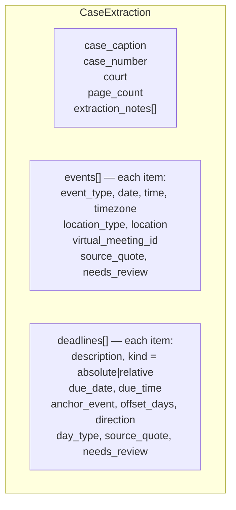

Every event and deadline keeps a **`source_quote`**: the exact sentence from the OCR text. That is the audit trail. If a date looks wrong, you search that quote in the `.ocr.txt` file.

**Sample `CaseExtraction` (trimmed from the case 1 golden):**

```json
{
  "case_caption": "Capital One NA vs. Anthony A Gomes",
  "case_number": "26-CC-001299",
  "court": "County Court of the Twentieth Judicial Circuit in and for Lee County, Florida",
  "events": [
    {
      "event_type": "docket_sounding",
      "date": "2026-12-08",
      "time": "08:30:00",
      "timezone": "America/New_York",
      "location_type": "virtual",
      "location": null,
      "virtual_meeting_id": "311 329 7498",
      "source_quote": "Docket Sounding will be held on December 8, 2026 at 8:30 A.M. VIA ZOOM (ID: 311 329 7498), Lee County Justice Center Courtroom 3C, 1700 Monroe Street, Fort Myers, FL 33901.",
      "needs_review": false
    },
    {
      "event_type": "trial_period",
      "date": "2027-12-15",
      "time": "09:00:00",
      "timezone": "America/New_York",
      "location_type": "physical",
      "location": null,
      "virtual_meeting_id": null,
      "source_quote": "This cause is set for TRIAL during the four week trial period beginning December 15, 2027 at 9:00 A.M., in COURTROOM 3C...",
      "needs_review": false
    }
  ],
  "deadlines": [
    {
      "description": "Exchange of Expert & Lay Witnesses",
      "kind": "relative",
      "due_date": null,
      "due_time": null,
      "anchor_event": "Docket Sounding",
      "offset_days": 30,
      "direction": "before",
      "day_type": "calendar",
      "source_quote": "No later than thirty (30) days prior to the Docket Sounding, counsel and/or parties shall file and exchange a list...",
      "needs_review": false
    }
  ],
  "extraction_notes": [],
  "page_count": 4
}
```

Notice the witness-exchange deadline has `kind: "relative"` and **no** `due_date`. The extract step is not allowed to invent “November 8, 2026.” That math is left for a human.

### 7.4 Final output format (`ReviewPackage`)

This is what `python scripts\run_court_workflow.py --pdf "fixtures\court\case 1.pdf" --pretty` prints.

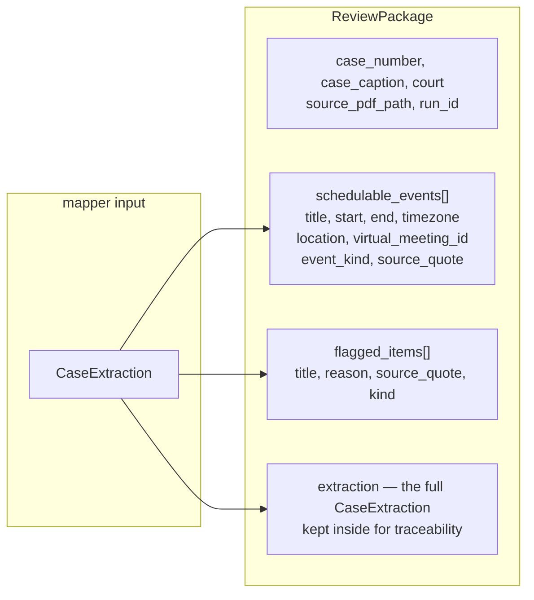

**Mapper rules** (implemented in `workflows\court_calendar\map_extraction.py`):

| What the extract step found | What the mapper emits | Why |
|-----------------------------|-----------------------|-----|
| Event with both `date` and `time` | `schedulable_events` item | Concrete datetime |
| Event with `needs_review=true` | `flagged_items` | Extraction was unsure |
| Event missing `date` | `flagged_items` | Cannot put it on a calendar |
| Absolute deadline with `due_date` | `schedulable_events` with `event_kind=deadline` | Computable |
| Relative deadline | `flagged_items` | Needs a human to pick the anchor date |
| Absolute deadline missing `due_date` | `flagged_items` | Cannot compute |

Relative deadlines are **never auto-computed**. A flagged reason looks like: `"Relative deadline: 30 days before Docket Sounding"`.

**Sample `ReviewPackage` (trimmed):**

```json
{
  "case_number": "26-CC-001299",
  "case_caption": "Capital One NA vs. Anthony A Gomes",
  "court": "County Court of the Twentieth Judicial Circuit in and for Lee County, Florida",
  "schedulable_events": [
    {
      "title": "Docket Sounding - Capital One NA vs. Anthony A Gomes",
      "start": "2026-12-08T08:30:00",
      "end": "2026-12-08T09:30:00",
      "timezone": "America/New_York",
      "location": "VIA ZOOM",
      "virtual_meeting_id": "311 329 7498",
      "description": "Case: 26-CC-001299\nCourt: County Court of the Twentieth Judicial Circuit...\nSource PDF: C:\\Users\\YourName\\pollack\\fixtures\\court\\case 1.pdf\nQuote: Docket Sounding will be held on December 8, 2026...",
      "event_kind": "hearing",
      "needs_review": false,
      "source_quote": "Docket Sounding will be held on December 8, 2026 at 8:30 A.M. VIA ZOOM (ID: 311 329 7498)..."
    },
    {
      "title": "Trial Period - Capital One NA vs. Anthony A Gomes",
      "start": "2027-12-15T09:00:00",
      "end": "2027-12-15T10:00:00",
      "timezone": "America/New_York",
      "location": null,
      "virtual_meeting_id": null,
      "description": "Case: 26-CC-001299\n...",
      "event_kind": "trial_period",
      "needs_review": false,
      "source_quote": "This cause is set for TRIAL during the four week trial period beginning December 15, 2027..."
    }
  ],
  "flagged_items": [
    {
      "title": "Deadline: Exchange of Expert & Lay Witnesses",
      "reason": "Relative deadline: 30 days before Docket Sounding",
      "source_quote": "No later than thirty (30) days prior to the Docket Sounding...",
      "kind": "deadline"
    }
  ],
  "extraction": { "...the full CaseExtraction object from above..." },
  "source_pdf_path": "C:\\Users\\YourName\\pollack\\fixtures\\court\\case 1.pdf",
  "email_subject": null,
  "email_sender": null,
  "run_id": "a1b2c3d4-...."
}
```

`start` / `end` are naive local datetimes. `timezone` is a separate IANA name (almost always `America/New_York` for these fixtures). Events default to a one-hour duration.

### 7.5 Commands

```powershell
# Structured extract only
python scripts\extract_court_doc.py "fixtures\court\case 1.pdf" --pretty

# Full pipeline to the terminal
python scripts\run_court_workflow.py --pdf "fixtures\court\case 1.pdf" --pretty

# Full pipeline written to a file
python scripts\run_court_workflow.py --pdf "fixtures\court\case 1.pdf" --output review.json

# From a saved email
python scripts\run_court_workflow.py --email C:\intake\notice.eml --pretty

# Force a brand-new OCR (ignores the .ocr.txt cache)
python scripts\extract_court_doc.py "fixtures\court\case 1.pdf" --refresh-ocr --pretty

# Offline calendar proposal from a golden extract JSON (no live LLM)
python scripts\propose_calendar.py "fixtures\court\case 1.pdf" --from-golden evals\court\extract\goldens\case_1.json --pretty
```

---

## 8. Workflow B — Account classification

**Job:** Read one consumer document (credit-card statement, auto deficiency notice, student-loan bill, and so on) and label it as one of the firm’s seven account archetypes.

### 8.1 The seven archetypes

| Value you will see in JSON | Everyday meaning |
|----------------------------|------------------|
| `credit_card` | Revolving card / store card |
| `retail_installments` | Store financing, BNPL, installment contracts |
| `fintech` | Online / marketplace personal loans (not LendingPoint) |
| `student_loan` | Student loans |
| `lending_point` | LendingPoint-originated accounts |
| `auto_deficiency` | Auto finance after repossession / deficiency |
| `other` | Does not fit (mortgage, medical, etc.) |

There is also an internal `unknown`. The workflow maps that to `other` and marks the package `needs_review`.

### 8.2 Input format

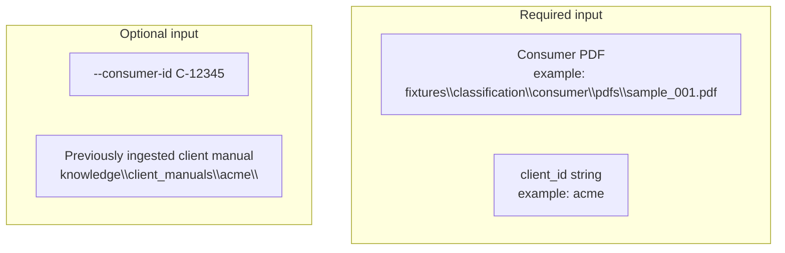

You can optionally ingest a client’s product manual first. That stores a taxonomy (their words for product types) plus searchable text chunks. Classification then retrieves a few passages and shows them to the model.

```powershell
python scripts\ingest_client_manual.py acme C:\manuals\acme-products.pdf --pretty
```

**Sample ingest output (`ClientTaxonomy`):**

```json
{
  "client_id": "acme",
  "product_types": [
    {
      "product_type": "credit_card",
      "definition": "Revolving consumer credit card accounts",
      "keywords": ["credit card", "APR", "cardmember"],
      "issuer_patterns": [],
      "example_descriptions": ["Monthly credit card statement"]
    }
  ],
  "field_definitions": [],
  "rules": [],
  "version": "1",
  "source_manual_path": "C:\\manuals\\acme-products.pdf"
}
```

That JSON is persisted under `knowledge\client_manuals\acme\`. If you skip ingest, classification still works using the built-in baseline taxonomy in `classification\taxonomy.py`.

### 8.3 What happens inside

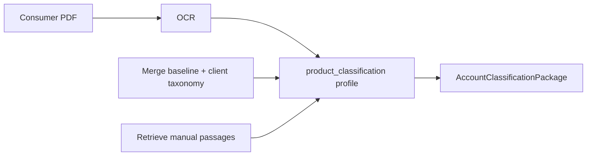

### 8.4 Output format

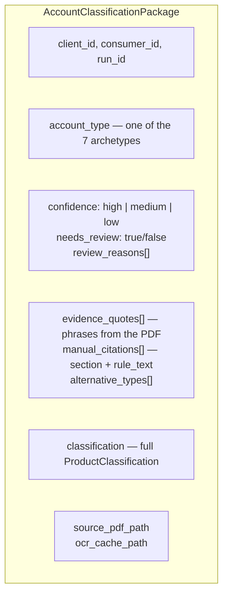

**Sample command:**

```powershell
python scripts\run_account_classification.py acme "fixtures\classification\consumer\pdfs\sample_001.pdf" --consumer-id C-12345 --pretty
```

**Sample output:**

```json
{
  "client_id": "acme",
  "consumer_id": "C-12345",
  "account_type": "credit_card",
  "confidence": "high",
  "needs_review": false,
  "review_reasons": [],
  "evidence_quotes": [
    "Credit Card Statement",
    "Cardmember: JANE DOE",
    "Minimum Payment Due"
  ],
  "manual_citations": [
    {
      "section": "Revolving products",
      "rule_text": "Statements that list a credit limit and APR are credit_card."
    }
  ],
  "alternative_types": [],
  "classification": {
    "client_id": "acme",
    "product_type": "credit_card",
    "confidence": "high",
    "evidence_quotes": ["Credit Card Statement", "Cardmember: JANE DOE"],
    "manual_citations": [],
    "needs_review": false,
    "alternative_types": []
  },
  "source_pdf_path": "C:\\Users\\YourName\\pollack\\fixtures\\classification\\consumer\\pdfs\\sample_001.pdf",
  "ocr_cache_path": "C:\\Users\\YourName\\pollack\\fixtures\\classification\\consumer\\pdfs\\sample_001.ocr.txt",
  "run_id": "f9e8d7c6-...."
}
```

`needs_review` is the human-attention flag. Low confidence, `unknown`/`other`, or conflicting evidence will turn it on and fill `review_reasons`.

---

## 9. Workflow C — Portfolio classification

**Job:** Classify **many** accounts at once from a firm portfolio dump. The dump is a fixed-width `.dat` text file (every field lives at a character offset, not in commas). When an officer code maps to exactly one archetype, Pollack skips the AI. When the code is missing or maps to several archetypes, it opens that account’s PDFs and asks the model.

### 9.1 Input format

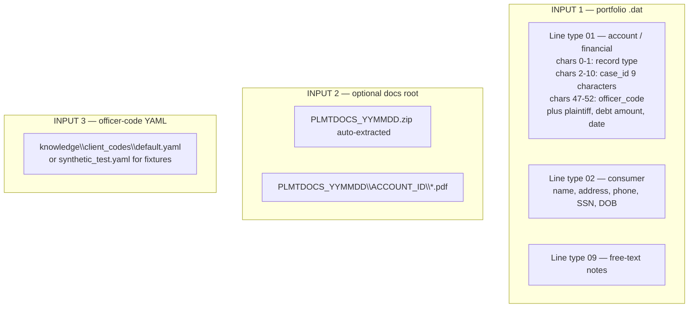

A `.dat` file is **not** CSV. One physical line is one record. Fields are sliced by character position (see `portfolio\dat_parser.py`):

| Slice | Field |
|-------|-------|
| `0:2` | Record type (`01`, `02`, `09`) |
| `2:11` | Case id (9 characters) |
| `47:53` | Officer code |
| `57:61` | Misc / product code |

Several lines that share the same case id are grouped into one `DatCase`.

**Sample inspect output:**

```powershell
python scripts\inspect_dat.py fixtures\portfolio\sample.dat
```

```
record_types: {'01': 12, '02': 12, '09': 8}
officer_code_lengths: {6: 24}
sample:
  line 1  type=01  case_id=000240001  officer=TSTSL1
  line 2  type=02  case_id=000240001  officer=TSTSL1
  ...
```

**Docs-root layout** (after any zip is extracted):

```
fixtures\portfolio\
  sample.dat
  case_id_map.yaml
  250708\
    PLMTDOCS_250708.zip
    PLMTDOCS_250708\
      SL-24001\
        statement.pdf
      AL-88021\
        deficiency.pdf
```

`--docs-root` must be the **directory**, not the zip. Any `PLMTDOCS_YYMMDD.zip` inside is unzipped automatically on run.

**Officer-code YAML** (one row maps an officer code + product code to an archetype):

```yaml
- officer_code: TSTSL1
  portfolio: "TEST Student Loan / SL-24001"
  product_code: STUL
  product_description: TEST_STUDENT_01 Blue Harbor
  archetype: student_loan
```

If the same `officer_code` appears with different archetypes, that code is **ambiguous** and the LLM path runs.

### 9.2 What happens inside

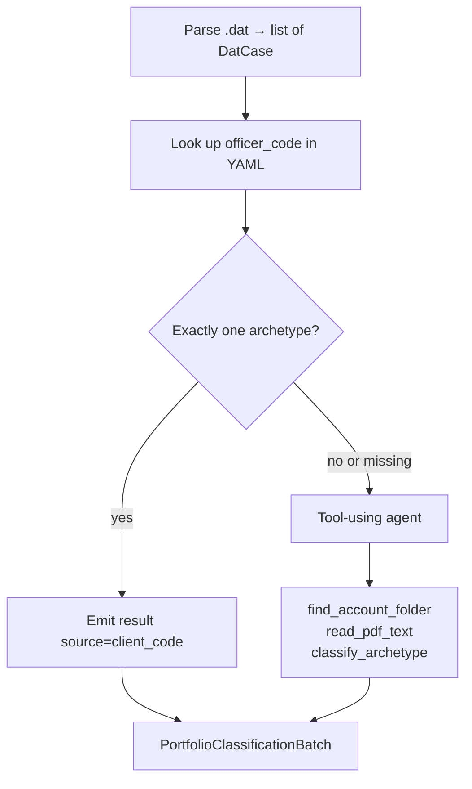

If you omit `--docs-root`, unique codes still classify. Ambiguous or missing codes become `source: "unresolved"`.

If a single account’s LLM call fails or times out, **the batch does not abort**. That account comes back as `needs_review` with the error in `evidence`.

### 9.3 Output format

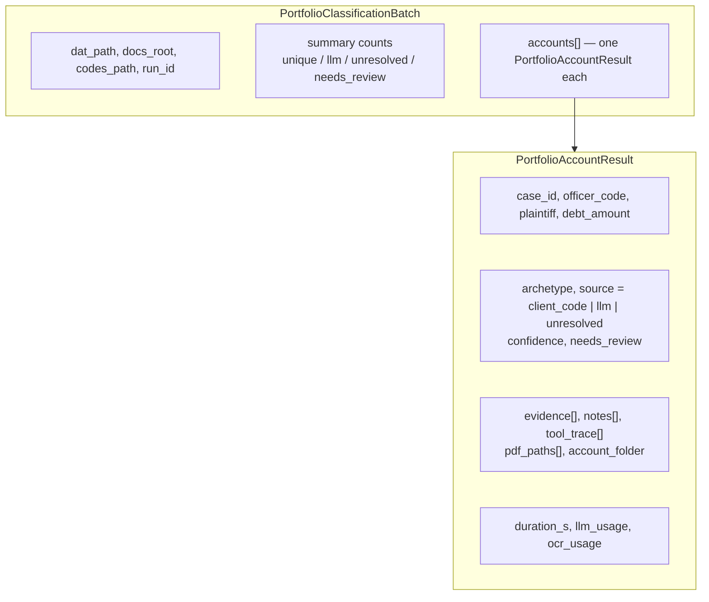

**Sample command (synthetic fixtures):**

```powershell
python scripts\run_portfolio_classification.py `
  --dat fixtures\portfolio\sample.dat `
  --docs-root fixtures\portfolio `
  --codes knowledge\client_codes\synthetic_test.yaml `
  --pretty
```

Use `synthetic_test.yaml` with the sample fixtures. Use `default.yaml` (or omit `--codes`) for real client manuals.

**Sample output (two of twelve accounts):**

```json
{
  "dat_path": "C:\\Users\\YourName\\pollack\\fixtures\\portfolio\\sample.dat",
  "docs_root": "C:\\Users\\YourName\\pollack\\fixtures\\portfolio",
  "codes_path": "C:\\Users\\YourName\\pollack\\knowledge\\client_codes\\synthetic_test.yaml",
  "run_id": "11aa22bb-....",
  "summary": {
    "accounts": 12,
    "client_code": 4,
    "llm": 8,
    "unresolved": 0,
    "needs_review": 2
  },
  "accounts": [
    {
      "case_id": "000240001",
      "account_folder": "C:\\Users\\YourName\\pollack\\fixtures\\portfolio\\250708\\PLMTDOCS_250708\\SL-24001",
      "archetype": "student_loan",
      "source": "client_code",
      "officer_code": "TSTSL1",
      "product_codes_considered": ["STUL"],
      "confidence": "high",
      "needs_review": false,
      "evidence": ["Officer code TSTSL1 maps uniquely to student_loan"],
      "pdf_paths": [],
      "tool_trace": [],
      "plaintiff": "Blue Harbor Servicing",
      "debt_amount": "18420.55",
      "notes": [],
      "duration_s": 0.04,
      "llm_usage": {},
      "ocr_usage": {}
    },
    {
      "case_id": "000880021",
      "account_folder": "C:\\Users\\YourName\\pollack\\fixtures\\portfolio\\250708\\PLMTDOCS_250708\\AL-88021",
      "archetype": "auto_deficiency",
      "source": "llm",
      "officer_code": "TSTAMB",
      "product_codes_considered": ["??", "LOAN", "AUTO"],
      "confidence": "medium",
      "needs_review": false,
      "evidence": ["VIN listed", "Repossession notice dated 2024-11-02"],
      "pdf_paths": [
        "C:\\Users\\YourName\\pollack\\fixtures\\portfolio\\250708\\PLMTDOCS_250708\\AL-88021\\deficiency.pdf"
      ],
      "tool_trace": [
        "find_account_folder → AL-88021",
        "read_pdf_text → deficiency.pdf (1842 chars)",
        "classify_archetype → auto_deficiency"
      ],
      "plaintiff": "Metroline Motors",
      "debt_amount": "9620.00",
      "notes": [],
      "duration_s": 47.2,
      "llm_usage": { "input_tokens": 4100, "output_tokens": 180 },
      "ocr_usage": { "input_tokens": 12000, "output_tokens": 900 }
    }
  ]
}
```

Synthetic fixture codes (so you know which path you are exercising):

| Path | Officer codes | What happens |
|------|---------------|--------------|
| Unique (no LLM) | `TSTSL1`, `TSTPL1`, `TSTRI1`, `TSTAL1` | Immediate `source=client_code` |
| Ambiguous | `TSTAMB` | LLM + PDFs when `--docs-root` is set |
| Missing | `TSTMSS` (not in the YAML) | Same LLM fallback |

Find one account’s PDFs without classifying:

```powershell
python scripts\find_account_pdfs.py fixtures\portfolio 000240001 --pretty
```

---

## 10. Workflow D — PII redaction

**Job:** Find names, Social Security numbers, and addresses on a PDF, locate them on the page, and write a new visually redacted PDF. The JSON manifest never stores a full SSN — only the last four digits.

### 10.1 Input format

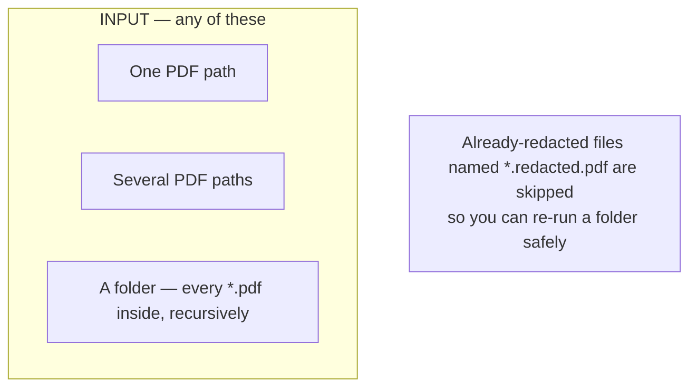

The synthetic eval fixture is a one-page form. Its OCR sidecar looks like:

```
--- Page 1 ---
Consumer Information Form

Name: Jane Q. Public
SSN: 123-45-6789
Address: 742 Evergreen Terrace, Springfield, IL 62704

Account reference: ACCT-0000
```

Those three values are **fake**. Real consumer PDFs must not be committed.

### 10.2 What happens inside

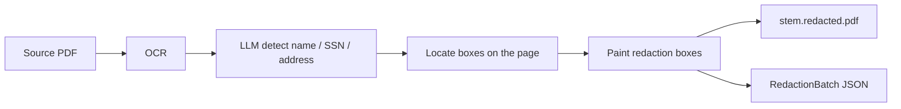

1. **Detect** — qwen reads OCR text and returns `PiiCandidate` rows (`entity_type`, `text`, `confidence`, `page`).
2. **Locate** — search the PDF text layer for that string; if needed, a vision pass returns normalized boxes (`x0,y0,x1,y1` in `0..1`, origin top-left).
3. **Apply** — write `{original-stem}.redacted.pdf` beside the source, or into `--out-dir`.

### 10.3 Output format

Two artifacts per source PDF:

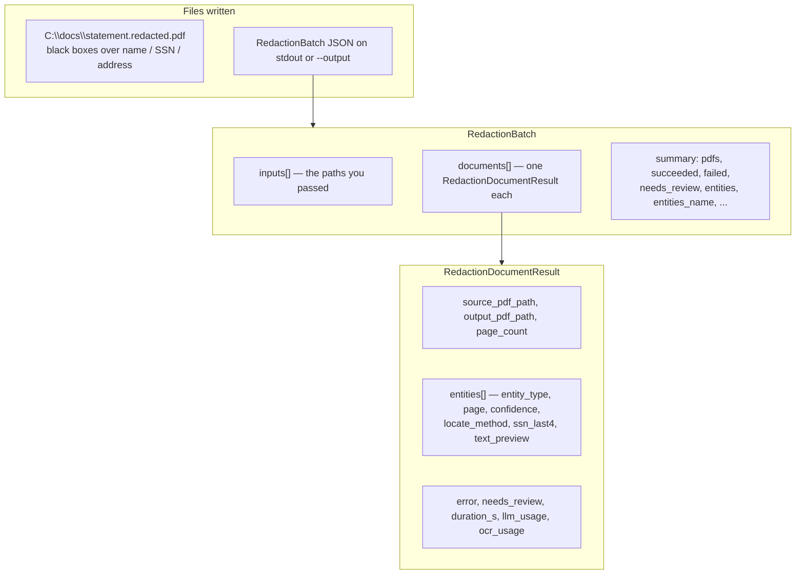

**Sample command:**

```powershell
python scripts\run_redaction.py C:\docs\consumer --out-dir C:\docs\redacted --pretty --output C:\docs\redacted\manifest.json
```

**Sample `RedactionBatch`:**

```json
{
  "inputs": ["C:\\docs\\consumer"],
  "run_id": "99aa88bb-....",
  "summary": {
    "pdfs": 1,
    "succeeded": 1,
    "failed": 0,
    "needs_review": 0,
    "entities": 3,
    "entities_name": 1,
    "entities_ssn": 1,
    "entities_address": 1
  },
  "documents": [
    {
      "source_pdf_path": "C:\\docs\\consumer\\statement.pdf",
      "output_pdf_path": "C:\\docs\\redacted\\statement.redacted.pdf",
      "page_count": 1,
      "entities": [
        {
          "entity_type": "name",
          "page": 1,
          "confidence": "high",
          "locate_method": "search",
          "ssn_last4": null,
          "text_preview": "Jane Q. Public"
        },
        {
          "entity_type": "ssn",
          "page": 1,
          "confidence": "high",
          "locate_method": "search",
          "ssn_last4": "6789",
          "text_preview": null
        },
        {
          "entity_type": "address",
          "page": 1,
          "confidence": "high",
          "locate_method": "search",
          "ssn_last4": null,
          "text_preview": "742 Evergreen Terrace"
        }
      ],
      "entity_counts": { "name": 1, "ssn": 1, "address": 1 },
      "error": null,
      "needs_review": false,
      "duration_s": 22.4,
      "llm_usage": { "input_tokens": 900, "output_tokens": 120 },
      "ocr_usage": { "input_tokens": 4000, "output_tokens": 350 }
    }
  ]
}
```

`needs_review` is true when any entity is not `high` confidence, or when detect found candidates that locate could not place. A failed PDF does not stop the rest of the folder; it appears with `error` set.

---

## 11. CLI reference (every script)

Run from the project root with `(.venv)` active.

### Court

#### `scripts\extract_court_doc.py`

OCR + LLM extract. Prints `CaseExtraction` JSON.

```
python scripts\extract_court_doc.py [-h] [--pretty] [--refresh-ocr] pdf
```

| Flag | Meaning |
|------|---------|
| `pdf` | Path to the court PDF |
| `--pretty` | Indent the JSON so it is readable |
| `--refresh-ocr` | Ignore `{stem}.ocr.txt` and OCR again |

```powershell
python scripts\extract_court_doc.py "fixtures\court\case 1.pdf" --pretty
```

#### `scripts\run_court_workflow.py`

Full pipeline. Prints or writes `ReviewPackage` JSON. Pass **either** `--pdf` or `--email`.

```
python scripts\run_court_workflow.py [-h] (--pdf PDF | --email EMAIL)
                                     [--pretty] [--output OUTPUT] [--refresh-ocr]
```

```powershell
python scripts\run_court_workflow.py --pdf "fixtures\court\case 1.pdf" --pretty
python scripts\run_court_workflow.py --pdf "fixtures\court\case 1.pdf" --output review.json
python scripts\run_court_workflow.py --email C:\intake\notice.eml --pretty
```

#### `scripts\propose_calendar.py`

Extract + map, or map a golden extract JSON with no live LLM.

```
python scripts\propose_calendar.py [-h] [--pretty] [--from-golden FROM_GOLDEN]
                                   [--refresh-ocr] pdf
```

```powershell
python scripts\propose_calendar.py "fixtures\court\case 1.pdf" `
  --from-golden evals\court\extract\goldens\case_1.json --pretty
```

### Classification

#### `scripts\run_account_classification.py`

```
python scripts\run_account_classification.py [-h] [--pretty] [--refresh-ocr]
                                             [--consumer-id ID] [--output OUTPUT]
                                             client_id pdf
```

```powershell
python scripts\run_account_classification.py acme "fixtures\classification\consumer\pdfs\sample_001.pdf" --consumer-id C-12345 --pretty
```

#### `scripts\ingest_client_manual.py`

```
python scripts\ingest_client_manual.py [-h] [--pretty] [--refresh-ocr] client_id pdf
```

Writes `ClientTaxonomy` JSON to the terminal **and** to `knowledge\client_manuals\{client_id}\`.

```powershell
python scripts\ingest_client_manual.py acme C:\manuals\acme.pdf --pretty
```

### Portfolio

#### `scripts\run_portfolio_classification.py`

```
python scripts\run_portfolio_classification.py --dat DAT [--docs-root DOCS]
                                              [--codes CODES] [--client-id ID]
                                              [--no-cache] [--pretty]
```

| Flag | Meaning |
|------|---------|
| `--dat` | Portfolio `.dat` path |
| `--docs-root` | Root **directory** of `PLMTDOCS_*` folders (not the zip) |
| `--codes` | YAML table. Default `knowledge\client_codes\default.yaml` |
| `--client-id` | Taxonomy context for the LLM path |
| `--no-cache` | Ignore OCR sidecars |
| `--pretty` | Indent JSON |

```powershell
python scripts\run_portfolio_classification.py `
  --dat fixtures\portfolio\sample.dat `
  --docs-root fixtures\portfolio `
  --codes knowledge\client_codes\synthetic_test.yaml `
  --pretty
```

#### `scripts\inspect_dat.py`

```
python scripts\inspect_dat.py DAT [--limit N] [--json]
```

Prints record-type counts, officer-code lengths, and sample parsed fields. Use this when locking offsets against a real firm file.

#### `scripts\find_account_pdfs.py`

```
python scripts\find_account_pdfs.py DOCS_ROOT CASE_ID [--pretty]
```

Extracts any `PLMTDOCS_YYMMDD.zip` under the root, then locates that case’s folder.

### Redaction

#### `scripts\run_redaction.py`

```
python scripts\run_redaction.py PATH [PATH ...] [--out-dir DIR] [--pretty]
                                   [--output MANIFEST.json] [--refresh-ocr]
```

`PATH` can be a PDF, several PDFs, or a folder.

```powershell
python scripts\run_redaction.py C:\docs\consumer --out-dir C:\docs\redacted --pretty --output manifest.json
```

### Health and debugging

#### `scripts\check_ollama.py`

```powershell
python scripts\check_ollama.py
```

Lists installed models and sends one chat message. Exits non-zero if `OLLAMA_MODEL` is not installed.

#### `scripts\debug_classify.py`

Fast single-document classifier (seconds, not the full agent loop). Point it at a cached `.ocr.txt` or a PDF.

```
python scripts\debug_classify.py (--ocr OCR | --pdf PDF) [--client-id ID]
                                 [--candidates LIST] [--officer-code CODE]
                                 [--plaintiff P] [--notes N] [--no-cache]
```

```powershell
python -u scripts\debug_classify.py `
  --ocr C:\data\docs_root\ACME\ACME_statement.ocr.txt `
  --candidates auto_deficiency,fintech
```

`python -u` turns off output buffering so you see tokens as they arrive.

#### `scripts\debug_ambiguous_agent.py`

Runs one portfolio ambiguous-case agent and prints every tool call, return value, timing, and the final label.

```
python scripts\debug_ambiguous_agent.py [--case-id ID] [--dat DAT] [--docs DOCS]
                                        [--codes CODES] [--case-map MAP]
                                        [--client-id ID] [--no-cache] [--clip N]
```

```powershell
python -u scripts\debug_ambiguous_agent.py `
  --dat C:\data\portfolio.dat `
  --docs C:\data\docs_root `
  --codes knowledge\client_codes\default.yaml `
  --case-id 000123456
```

---

## 12. Calling Pollack from Python

All of these functions are `async`. From a script you typically wrap them with `asyncio.run(...)`. From a notebook or another async function, `await` them.

### Court workflow

```python
import asyncio
from pathlib import Path
from agents.supervisor import run_court_workflow, format_scheduling_output

async def main():
    package = await run_court_workflow(pdf_path=Path(r"fixtures\court\case 1.pdf"))
    print(format_scheduling_output(package, pretty=True))

asyncio.run(main())
```

Pass `email_path=Path(r"C:\intake\notice.eml")` instead of `pdf_path` for email intake. Pass `use_cache=False` to force fresh OCR.

Lower-level entry points live in `workflows\court_calendar\run.py`:

- `run_court_workflow_from_pdf(pdf_path, use_cache=True)`
- `run_court_workflow_from_email(email_path, use_cache=True)`

### Extract a profile yourself

```python
from pathlib import Path
from documents.profiles.registry import extract_document, list_profiles

print(list_profiles())
# ['court_calendar', 'client_manual_taxonomy', 'product_classification']

result = await extract_document(
    Path(r"fixtures\court\case 1.pdf"),
    profile="court_calendar",
    use_cache=True,
)
```

`product_classification` expects extra `context={...}` (taxonomy + manual passages). The account-classification workflow fills that in for you.

### Mapper only (no LLM)

Useful in tests, or when you already have a `CaseExtraction` JSON file:

```python
from pathlib import Path
from court.schemas import CaseExtraction
from workflows.court_calendar.map_extraction import map_extraction_to_review_package

path = Path(r"evals\court\extract\goldens\case_1.json")
extraction = CaseExtraction.model_validate_json(path.read_text(encoding="utf-8"))
package = map_extraction_to_review_package(extraction, pdf_path=path)
print(len(package.schedulable_events), "events;", len(package.flagged_items), "flagged")
```

### Other supervisors

```python
from agents.supervisor import (
    run_account_classification_workflow,
    run_portfolio_classification_workflow,
    run_redaction_workflow,
)

acct = await run_account_classification_workflow("acme", Path(r"C:\docs\statement.pdf"))
batch = await run_portfolio_classification_workflow(Path(r"C:\data\portfolio.dat"), docs_root=Path(r"C:\data\docs"))
redact = await run_redaction_workflow(Path(r"C:\docs\consumer"), out_dir=Path(r"C:\docs\redacted"))
```

---

## 13. Evals (quality checks)

An **eval** is an automated score of “did this run still do the right things?” It is not the same as a unit test. Unit tests check Python logic with frozen inputs. Evals run the real pipeline (sometimes with a live model) against labeled cases.

Pollack evals use **checklist assertions**, not “the JSON must match the golden byte-for-byte.” LLM wording changes between runs. Goldens are reference material. Evaluators check things like: case number present, at least N events, required OCR phrases found, forbidden PII gone.

### 13.1 Suites

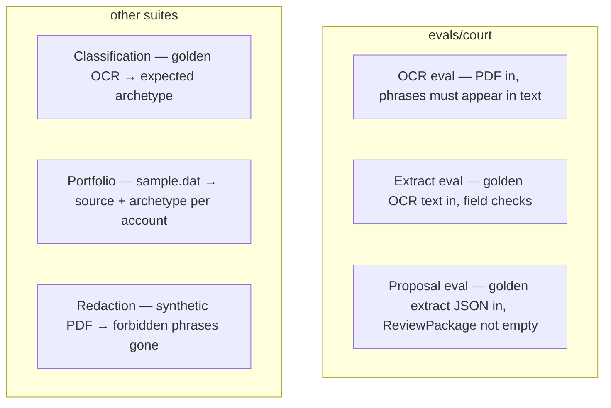

| Suite | Script | Needs Ollama? | Input | What “pass” means |
|-------|--------|---------------|-------|-------------------|
| OCR | `evals\run_ocr_eval.py` | Yes (olmocr2), unless `--use-cache` | Live fixture PDFs | Required phrases appear in OCR text |
| Extract | `evals\run_extract_eval.py` | Yes (qwen) | Golden OCR `.ocr.txt` | Structured field checks (case number, min events, …) |
| Proposal | `evals\run_proposal_eval.py` | No | Golden extract JSON | Mapper produces a non-empty `ReviewPackage` |
| Classification | `evals\run_classification_eval.py` | Yes (qwen) | Golden OCR text | Expected archetype + evidence phrases |
| Portfolio | `evals\run_portfolio_eval.py` | Only for ambiguous/missing | `.dat` + docs + synthetic codes | `expected_source` and `expected_archetype` |
| Redaction | `evals\run_redaction_eval.py` | Yes (detect) | Synthetic text-layer PDF | Forbidden phrases absent; expected entity types |

Court cases live in `evals\court\cases.yaml` (`case_1`, `case_2`, `doc_viewer`). Classification has 21 consumer fixtures in `evals\classification\cases.yaml`. Portfolio has 12 accounts in `evals\portfolio\cases.yaml`. Redaction has one synthetic case in `evals\redaction\cases.yaml`.

Do **not** use the retired folders `evals\ocr\` or `evals\extract\`.

### 13.2 Running evals

```powershell
python evals\run_proposal_eval.py
python evals\run_extract_eval.py
python evals\run_ocr_eval.py --use-cache
python evals\run_ocr_eval.py
python evals\run_ocr_eval.py --case case_1
python evals\run_classification_eval.py
python evals\run_portfolio_eval.py --unique-only
python evals\run_portfolio_eval.py
python evals\run_portfolio_eval.py --case SL-24001 --case AL-88021
python evals\run_redaction_eval.py
```

`--use-cache` on the OCR eval reads `{pdf}.ocr.txt` next to each fixture and skips olmocr2. That is the fast smoke test.

`--unique-only` on the portfolio eval asserts `source=client_code` with no model calls.

### 13.3 Bootstrap goldens (first time, or after you change a model)

A **golden** is a saved “this is what good output looked like” file. Bootstrap creates them by running the live models once.

```powershell
python evals\bootstrap_goldens.py
```

Writes:

- `evals\court\ocr\goldens\*.ocr.txt`
- `evals\court\extract\goldens\*.json`
- `evals\court\cases.yaml` (derived phrases and extract checks)

On a CPU machine this is often 40+ minutes. After it finishes, **open `evals\court\cases.yaml` and read it**. The derived `required_phrases` and `extract_checks` sometimes need a human tweak.

Skip OCR and only rebuild extract goldens from existing OCR goldens:

```powershell
python evals\bootstrap_goldens.py --extract-only
```

Classification goldens:

```powershell
python evals\bootstrap_classification_goldens.py
python evals\bootstrap_classification_goldens.py --ocr --skip-classify
```

`--ocr` runs live olmocr2 (slow). `--skip-classify` only writes OCR goldens.

### 13.4 Regression snapshots

Every eval run, by default, writes a timestamped folder you can diff later. Snapshots **do not fail** the eval. They are for a person to compare.

```
evals\runs\{suite}\{timestamp}\
  manifest.json
  {case}\ocr.txt or extraction.json or review_package.json or ...
  {case}\meta.json
```

| Suite | Files per case |
|-------|----------------|
| `ocr` | `ocr.txt`, `meta.json` |
| `extract` | `extraction.json`, `meta.json` |
| `proposal` | `review_package.json`, `meta.json` |
| `classification` | `classification.json`, `meta.json` |
| `portfolio` | `account.json`, `meta.json`, plus `_batch\summary.json` |
| `redaction` | `document.json`, `meta.json` |

`meta.json` on classification/portfolio runs includes `task_duration_s`, token usage, and model names so you can compare Ollama vs OpenAI. The latest run path is stored in `evals\runs\{suite}\latest.txt`.

```powershell
python evals\run_extract_eval.py --snapshot-label before-prompt-change
python evals\run_extract_eval.py --no-snapshot
python evals\compare_snapshots.py extract\before-prompt-change extract\latest
python evals\compare_snapshots.py proposal\latest proposal\before-change
python evals\compare_snapshots.py evals\runs\extract\RUN_A evals\runs\extract\RUN_B
```

`compare_snapshots.py` accepts a suite name (`extract\latest` resolves through `latest.txt`) or a full folder path.

### 13.5 Adding a new court eval case

1. Put a **redacted** PDF in `fixtures\court\`.
2. Register it in `evals\court\cases.py`, or run bootstrap (which updates `cases.yaml`).
3. Run `python evals\bootstrap_goldens.py`.
4. Edit `evals\court\cases.yaml` if the derived checks are too tight or too loose.
5. Run OCR, extract, and proposal evals.

---

## 14. Sample fixtures

Everything under `fixtures\` is gitignored except `README` / `.gitkeep` files. Copy sample PDFs onto the machine yourself. **Do not commit unredacted PII.**

### Court PDFs

```
fixtures\court\case 1.pdf
fixtures\court\case 2.pdf
fixtures\court\DocViewer.pdf
```

```powershell
python scripts\extract_court_doc.py "fixtures\court\case 1.pdf" --pretty
```

OCR sidecars (`case 1.ocr.txt`, …) appear beside the PDF on first run.

### Consumer classification PDFs

```
fixtures\classification\consumer\pdfs\sample_001.pdf
...
fixtures\classification\consumer\pdfs\sample_021.pdf
```

Also used offline: `fixtures\classification\consumer\*.txt` and `*_classification.json`, plus manuals under `fixtures\classification\manuals\`. Labeled cases are registered in `evals\classification\cases.yaml`.

```powershell
python scripts\run_account_classification.py acme "fixtures\classification\consumer\pdfs\sample_001.pdf" --pretty
```

### Portfolio

```
fixtures\portfolio\sample.dat
fixtures\portfolio\case_id_map.yaml
fixtures\portfolio\<date>\PLMTDOCS_<date>.zip
fixtures\portfolio\<date>\PLMTDOCS_<date>\<account_id>\*.pdf
```

`sample.dat` is synthetic (12 cases). Manifest ids like `SL-24001` do not fit the 9-character `case_id` field, so `case_id_map.yaml` maps padded numeric ids (`000240001`) to account folders.

```powershell
python scripts\inspect_dat.py fixtures\portfolio\sample.dat
python scripts\find_account_pdfs.py fixtures\portfolio 000240001 --pretty
python evals\run_portfolio_eval.py
```

### Redaction

The synthetic PDF is created on demand under `evals\redaction\fixtures\` (fake name / SSN / address only).

```powershell
python evals\run_redaction_eval.py
pytest tests\test_redaction_offline.py -q
```

---

## 15. Tests, debugging, and a new machine

### 15.1 Offline unit tests (no Ollama)

```powershell
pytest tests\ -q
```

| File | What it covers |
|------|----------------|
| `tests\test_normalize.py` | Extraction cleanup |
| `tests\test_workflows.py` | Mapper, email parser |
| `tests\test_eval_offline.py` | Eval case loading, goldens, phrase matcher |
| `tests\test_eval_snapshots.py` | Snapshot writer and compare |
| `tests\test_platform.py` | Profile registry, audit log, manual store |
| `tests\test_classification_offline.py` | Classification fixtures |
| `tests\test_account_classification_workflow.py` | Account workflow with a mocked LLM |
| `tests\test_portfolio_offline.py` | `.dat` parsing, officer-code resolution |
| `tests\test_redaction_offline.py` | Locate + apply without a model |

`test_ocr_goldens_exist_and_contain_phrases` needs bootstrap goldens under `evals\court\ocr\goldens\`. On a fresh machine, bootstrap first.

The proposal eval is also offline:

```powershell
python evals\run_proposal_eval.py
```

### 15.2 Debugging tips

**Ollama stuck on “Stopping…”**  
Restart Ollama from the system tray, or run `ollama serve` in a dedicated PowerShell window. Common when olmocr2 hangs mid-page.

**Wrong scheduling output**

1. Open `ReviewPackage.flagged_items`. Each item has a `reason`.
2. Take `source_quote` and search it in `{pdf-stem}.ocr.txt`.
3. Re-run extract alone: `python scripts\extract_court_doc.py "fixtures\court\case 1.pdf" --pretty`

**Mapper decisions**  
Read `workflows\court_calendar\map_extraction.py`. Events need a `date` to become `SchedulableEvent`. Relative deadlines always go to `flagged_items`.

**Wrong classification archetype**  
`scripts\debug_classify.py` feeds one document to the classifier. Tune the prompt in `documents\profiles\product_classification.py`.

**Ambiguous agent not calling tools**  
`scripts\debug_ambiguous_agent.py` prints each tool call. Tune `portfolio\ambiguous_agent.py`. Use `python -u` for live output.

**Compare two eval runs**

```powershell
python evals\compare_snapshots.py proposal\baseline proposal\current
```

### 15.3 Runtime folders (created on first use, not committed)

| Path | Who creates it | Purpose |
|------|----------------|---------|
| `{same folder as the PDF}\{stem}.ocr.txt` | OCR | Page-text cache |
| `data\downloads\` | `PdfStore` | PDFs downloaded from email URLs |
| `data\workflow_runs.db` | Audit log | SQLite history of workflow runs |
| `evals\runs\{suite}\{timestamp}\` | Eval snapshots | Regression artifacts |
| `knowledge\client_manuals\{client_id}\` | Manual ingest | Taxonomy JSON + text chunks |
| `{stem}.redacted.pdf` | Redaction | Visually redacted copy |

### 15.4 Moving the project to a new Windows PC

**Copy:** source code, fixture PDFs, `requirements.txt`, `.env.example`, `evals\court\cases.yaml`.

**Do not copy:** `.venv\`, `fixtures\**\*.ocr.txt`, `evals\court\ocr\goldens\*`, `evals\court\extract\goldens\*`, `evals\runs\*`.

On the new machine:

1. Install Python 3.12+ and Ollama. Pull both models.
2. `python -m venv .venv` → `.\.venv\Scripts\Activate.ps1` → `pip install -r requirements.txt`
3. `Copy-Item .env.example .env`
4. `python evals\bootstrap_goldens.py` (live OCR + extract; budget an hour on CPU)
5. `pytest tests\ -q`, then the evals you care about

---

## 16. How the AI layer works

You can skip this section until you change prompts or add a workflow.

Pollack uses [Pydantic AI](https://ai.pydantic.dev/) (`pydantic-ai>=0.2.0`). An **agent** here is “a model plus a JSON schema plus a prompt,” not an autonomous loop.

| Piece | File | Role |
|-------|------|------|
| Agent factory | `agents\config.py` | `make_agent()` / `make_ocr_agent()` — the only place models are constructed |
| Shared extract helpers | `agents\extract_utils.py` | Temperature 0, retry-on-empty |
| OCR agent | `documents\ocr.py` | Sends a page PNG + “return all text” |
| Court extract | `court\extract.py` | Three module-level agents, `NativeOutput`, 3 retries |
| Supervisor | `agents\supervisor.py` | Deterministic router to a workflow |
| Audit log | `agents\audit.py` | SQLite at `data\workflow_runs.db` |
| Tool registry | `agents\registry.py` | Documents which tool *names* belong to each workflow (a contract, not a runtime dispatcher) |
| Shared deps | `agents\deps.py` | `WorkflowDeps` (PdfStore, AuditLog, knowledge root) |

Conventions when you add something:

1. New extract schema → a Pydantic model + `make_agent(output_type=NativeOutput(...))`.
2. Prefer several small agents (metadata / events / deadlines) over one giant schema.
3. Keep orchestration in async Python. Do not add LangGraph unless someone explicitly asks.
4. Put cleanup in Python after `result.output` (`court\normalize.py`), not inside model hooks.
5. Court extract agents are stateless: one `run(prompt)`, no chat history.

Workflow tool names (for reading logs, not for calling by hand):

| Workflow | Tools recorded in the audit log |
|----------|---------------------------------|
| Court scheduling | `parse_court_email`, `download_document`, `load_document_text`, `extract_document`, `propose_calendar_items`, `format_scheduling_output` |
| Account classification | `load_document_text`, `load_taxonomy`, `retrieve_manual_passages`, `extract_document`, `map_classification`, `format_classification_output` |
| Portfolio | `parse_dat`, `resolve_codes`, `locate_pdfs`, `ambiguous_classify`, `assemble_batch`, `format_portfolio_output` |
| Redaction | `load_document_text`, `detect_pii`, `locate_rects`, `apply_redactions`, `assemble_batch`, `format_redaction_output` |

---

## 17. Glossary

| Term | Meaning |
|------|---------|
| **OCR** | Optical character recognition. Turn a page image into text. |
| **Sidecar / cache** | A file kept next to the PDF (`case 1.ocr.txt`) so OCR is not repeated. |
| **JSON** | Text format of nested keys and values. Every workflow’s main output. |
| **Pydantic model** | A Python class that describes a JSON shape and validates it. |
| **Extract profile** | Named recipe (`court_calendar`, …) that fills one Pydantic model from a PDF. |
| **Workflow** | A complete job: ingest → extract → map → JSON (and maybe a new PDF). |
| **Golden** | Saved reference output used by evals. |
| **Eval** | Checklist run against goldens or live models. |
| **Snapshot** | Timestamped copy of an eval run, for human diffing. |
| **Archetype** | One of the seven firm account types (`credit_card`, `fintech`, …). |
| **Officer code** | Short code on a `.dat` line that often maps to an archetype. |
| **Fixed-width `.dat`** | Text file where field *position* (column 47, not a comma) defines the value. |
| **Relative deadline** | “30 days before Docket Sounding” — never auto-dated in v1. |
| **`needs_review`** | Boolean that means “a person should look at this.” |
| **`source_quote`** | Verbatim OCR sentence that justifies an extracted fact. |
| **Ollama** | Local app that serves the two models at `http://localhost:11434`. |
| **Virtual environment** | Isolated Python library folder (`.venv`) for this project. |
| **Supervisor** | Small Python router. Not an AI that chooses tools. |

---

## Quick command sheet

```powershell
# one-time
python -m venv .venv
.\.venv\Scripts\Activate.ps1
pip install -r requirements.txt
Copy-Item .env.example .env
ollama pull qwen2.5:7b
ollama pull richardyoung/olmocr2:7b-q8
python scripts\check_ollama.py

# daily
python scripts\run_court_workflow.py --pdf "fixtures\court\case 1.pdf" --pretty
python scripts\run_account_classification.py acme "fixtures\classification\consumer\pdfs\sample_001.pdf" --pretty
python scripts\run_portfolio_classification.py --dat fixtures\portfolio\sample.dat --docs-root fixtures\portfolio --codes knowledge\client_codes\synthetic_test.yaml --pretty
python scripts\run_redaction.py C:\docs\consumer --pretty

# quality
pytest tests\ -q
python evals\run_proposal_eval.py
python evals\bootstrap_goldens.py
```
